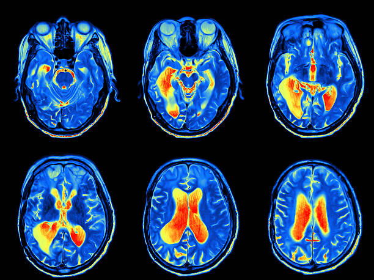
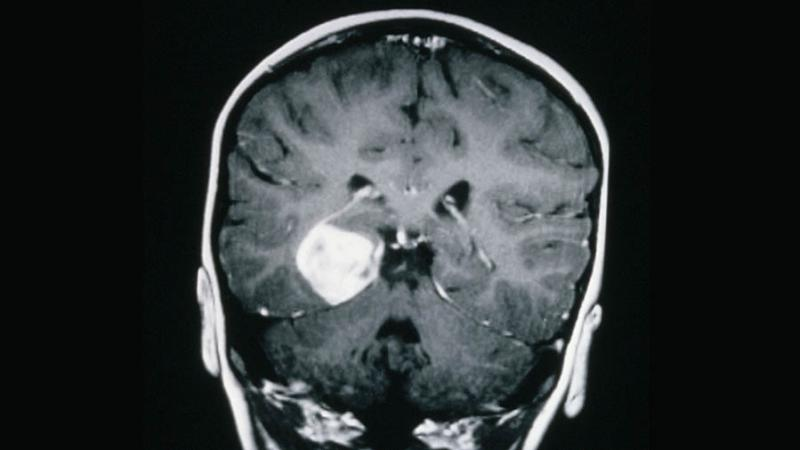

# Convolutions-on-biomedical-images
In this projected i decided to create two sets of sobel kernels: I created one set of five by five sobel kernels and actually one ofthe 5 X 5 kernels i decied to use decimal weight values just to see what i would get. The other set of sobel kernels were 3 X 3 with regular integer values. Sobel kernels are used for edge detection. You'll notice that before i applied the kernel to the image i converted to grayscale and that is a common practice in edge detection because it makes it much easier. The sobel kernel is great at detecting patterns of intensity of an image. By the way you'll probably notice some googledrive syntax thats becasue thats where i pulled my image from. I used colab for this project

